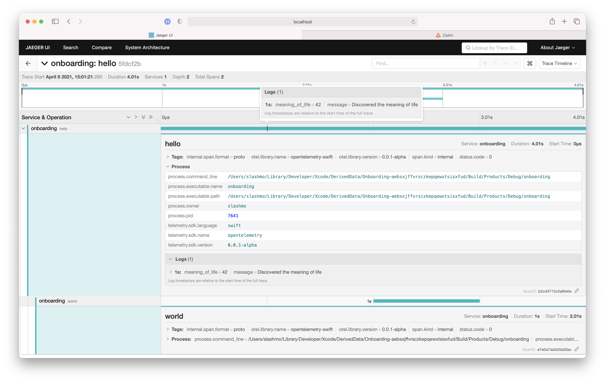
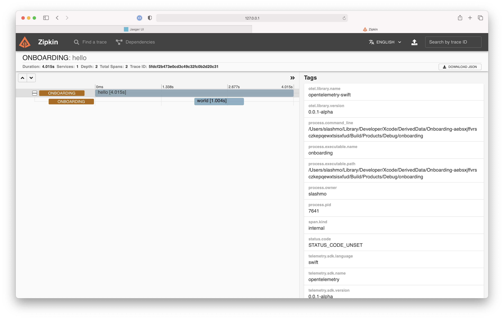

# OpenTelemetry for Swift

[](https://swift.org)
[](https://github.com/apple/swift-distributed-tracing)
[](https://github.com/slashmo/opentelemetry-swift/actions/workflows/ci.yaml)

An OpenTelemetry client implementation for Swift.

*OpenTelemetry Swift* builds on top of [Swift Distributed Tracing](https://github.com/apple/swift-distributed-tracing) by implementing its instrumentation & tracing API. This means that [any library instrumented using Swift Distributed Tracing](https://github.com/apple/swift-distributed-tracing#libraries--frameworks) will automatically work with *OpenTelemetry Swift*.

## Getting Started

In this guide we'll create a service called "onboarding". It won't do anything other than starting a couple of spans and exporting them, but it highlights the key aspects of "OpenTelemetry Swift" and how to set it up. To wet your appetite, here are screenshots from both [Jaeger](https://www.jaegertracing.io) & [Zipkin](https://zipkin.io) displaying a trace created by "onboarding":




> You can find the source code of the "onboarding" example [here](Examples/Onboarding).

### Installation

To add *OpenTelemetry Swift* to our project, we first need to include it as a package dependency:

```swift
.package(url: "https://github.com/slashmo/opentelemetry-swift.git", from: "0.1.0"),
```

Then we add `OpenTelemetry` to our executable target:

```swift
.product(name: "OpenTelemetry", package: "opentelemetry-swift"),
```

### Bootstrapping

Now that we installed *OpenTelemetry Swift*, it's time to bootstrap the instrumentation system to use OpenTelemetry. Before we can retrieve a tracer we need to configure and start the main object `OTel`:

```swift
import NIO
import OpenTelemetry
import Tracing

let group = MultiThreadedEventLoopGroup(numberOfThreads: 1)
let otel = OTel(serviceName: "onboarding", eventLoopGroup: group)

try otel.start().wait()
InstrumentationSystem.bootstrap(otel.tracer())
```

We should also **not forget to shutdown** `OTel` and the `EventLoopGroup`:

```swift
try otel.shutdown().wait()
try group.syncShutdownGracefully()
```

> ⚠️ With this setup, ended spans will be ignored and not exported to a tracing backend. Read on to learn more about [how to configure processing & exporting](#configuring-processing-and-exporting).

### Configuring processing and exporting

To change start processing and exporting spans, we must pass a **processor** to the `OTel` initializer. "OpenTelemetry Swift" comes with a number of built in processors and you can even build your own. Check out the ["Span Processors"](#span-processors) section to learn more.

For now, we're going to use the `SimpleSpanProcessor`. As the name suggests, this processor doesn't do much except for **forwarding ended spans to an exporter** one by one. This exporter must be injected when initializing the `SimpleSpanProcessor`.

#### Starting the collector

We want to export our spans to both Jaeger and Zipkin. The OpenTelemetry project provides the ["OpenTelemetry Collector"](https://github.com/open-telemetry/opentelemetry-collector) which acts as a middleman between clients such as "OpenTelemetry Swift" and tracing backends such as Jaeger and Zipkin. We won't go into much detail on how to configure the collector in this guide, but instead focus on our "onboarding" service.

We use Docker to run the OTel collector, Jaeger, and Zipkin locally. Both `docker-compose.yaml` and `collector-config.yaml` are located in the ["docker"](Examples/Onboarding/Docker) folder of the "onboarding" example.

```sh
# In Examples/Onboarding
docker-compose -f docker/docker-compose.yaml up --build
```

#### Using OtlpGRPCSpanExporter

After a couple of seconds everything should be up-and-running. Let's go ahead and **configure OTel to export to the collector**. "OpenTelemetry Swift" contains a second library called "OtlpGRPCSpanExporting", providing the necessary span exporter. We need to also include it in our target in `Package.swift`:

```swift
.product(name: "OtlpGRPCSpanExporting", package: "opentelemetry-swift"),
```

On to the fun part - Configuring the `OtlpGRPCSpanExporter`:

```swift
let exporter = OtlpGRPCSpanExporter(
    config: OtlpGRPCSpanExporter.Config(
        eventLoopGroup: group
    )
)
```

As mentioned above we need to inject this exporter into a processor:

```swift
let processor = OTel.SimpleSpanProcessor(exportingTo: exporter)
```

The only thing left to do is to tell `OTel` to use this processor:

```diff
- let otel = OTel(serviceName: "onboarding", eventLoopGroup: group)
+ let otel = OTel(serviceName: "onboarding", eventLoopGroup: group, processor: processor)
```

### Starting spans

Our demo application creates two spans: `hello` and `world`. To make things even more realistic we'll add an event to the `hello` span:

```swift
let rootSpan = InstrumentationSystem.tracer.startSpan("hello", baggage: .topLevel)

sleep(1)
rootSpan.addEvent(SpanEvent(
    name: "Discovered the meaning of life",
    attributes: ["meaning_of_life": 42]
))

let childSpan = InstrumentationSystem.tracer.startSpan("world", baggage: rootSpan.baggage)

sleep(1)
childSpan.end()

sleep(1)
rootSpan.end()
```

> Note that we retrieve the the tracer through `InstrumentationSystem.tracer` instead of directly using `otel.tracer()`. This allows us to easily switch out the bootstrapped tracer in the future. It's also how frameworks/libraries implement tracing support without even knowing about `OpenTelemetry`.

Finally, because the demo app start shutting down right after the last span was ended, we should add another delay to give the exporter a chance to finish its work:

```diff
+ sleep(1)
try otel.shutdown().wait()
try group.syncShutdownGracefully()
```

Now, when running the app, the trace including both spans will automatically appear in both Jaeger & Zipkin 🎉 You can find them at http://localhost:16686 & http://localhost:9411 respectively.

### Diving deeper 🤿

- View the [complete example here](Examples/Onboarding).

- To learn more about the `InstrumentationSystem`, check out the [Swift Distributed Tracing docs on the subject](https://github.com/apple/swift-distributed-tracing/blob/main/README.md#bootstrapping-the-instrumentationsystem).

- To learn more about instrumenting your Swift code, check out the [Swift Distributed Tracing docs on "instrumenting your code"](https://github.com/apple/swift-distributed-tracing#instrumenting-your-code).

- The "OpenTelemetry Collector" has many more configuration options. [Check them out here](https://opentelemetry.io/docs/collector/configuration/).

## Development

### Formatting

To ensure a consistent code style we use [SwiftFormat](https://github.com/nicklockwood/SwiftFormat).
To automatically run it before you push to GitHub, you may define a `pre-push` Git hook executing
the *soundness* script:

```sh
echo './scripts/soundness.sh' > .git/hooks/pre-push
chmod +x .git/hooks/pre-push
```
